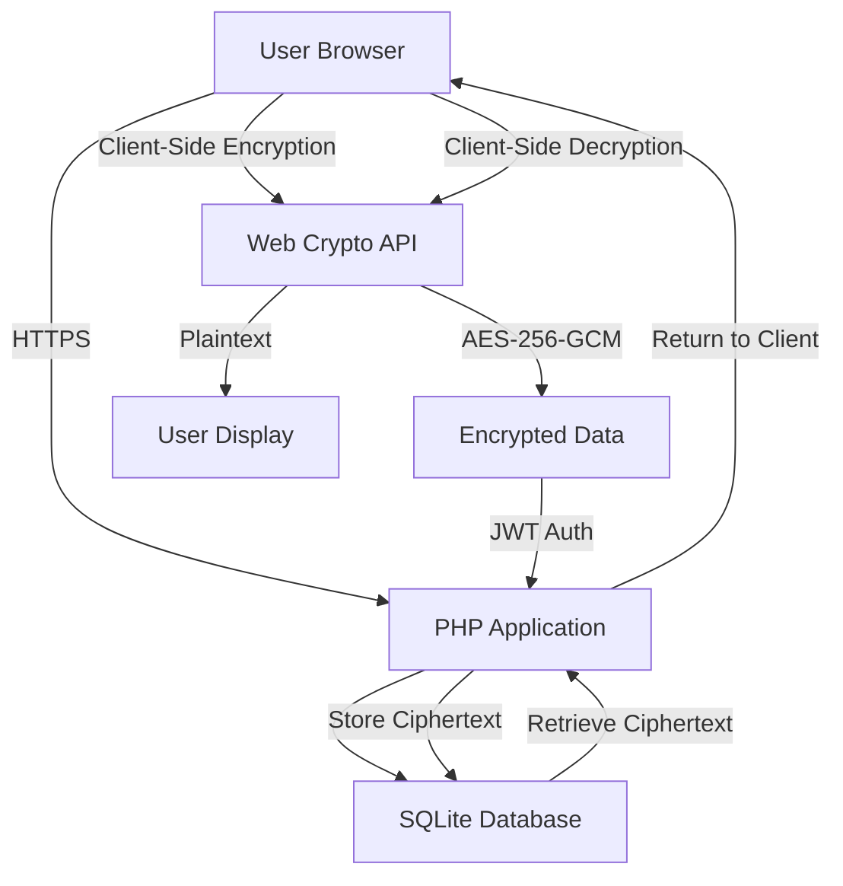
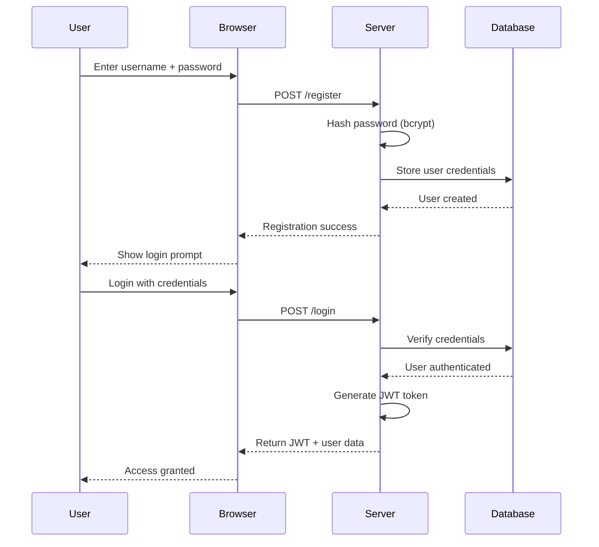
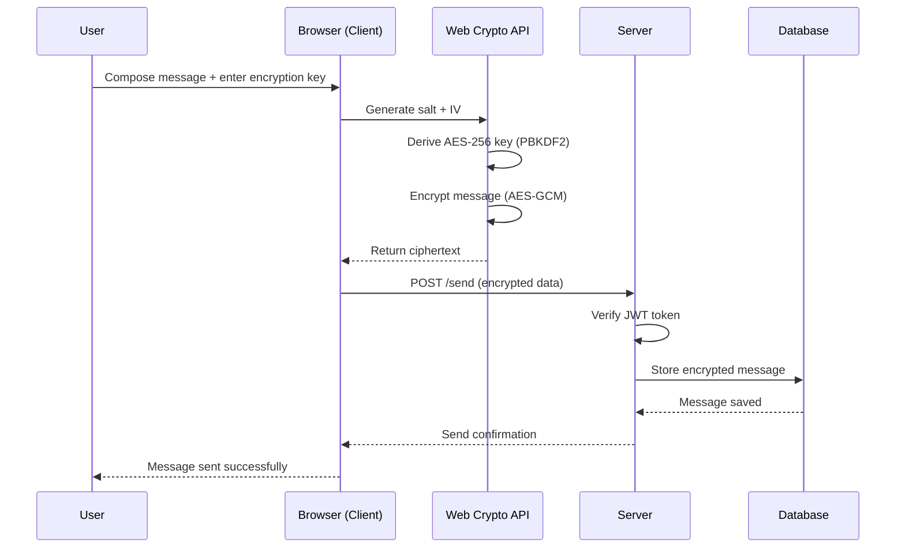
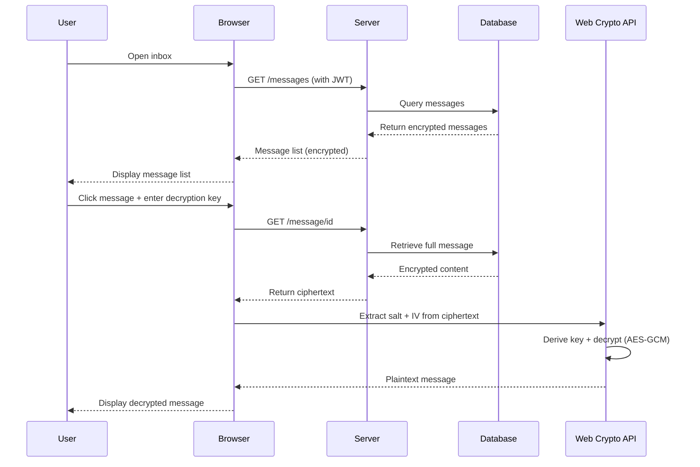

# xsukax E2EE Local Mailing System

[](https://www.gnu.org/licenses/gpl-3.0)
[](https://www.php.net/)
[](https://www.sqlite.org/)

A complete end-to-end encrypted local mailing system contained in a single PHP file, featuring zero-knowledge architecture with AES-256-GCM encryption. Deploy instantly on any domain with nginx or Apache — no configuration required.

## 🔒 Project Overview

The xsukax E2EE Local Mailing System is a self-contained, privacy-focused email solution designed for organizations and individuals who require complete control over their communications infrastructure. Built as a single PHP file with an embedded SQLite database, this application provides enterprise-grade encryption while maintaining simplicity in deployment and management.

**Core Capabilities:**
- **Single-File Architecture**: The entire application (API, web interface, and database schema) resides in one PHP file
- **Zero-Knowledge Encryption**: All message content is encrypted client-side before transmission; the server never has access to plaintext data
- **Domain-Agnostic**: Automatically adapts to any domain or subdomain without configuration changes
- **Comprehensive Mail Management**: Full-featured inbox, trash, and compose interfaces with attachment support
- **RESTful API**: JSON-based API for integration with external applications or custom clients

## 🛡️ Security and Privacy Benefits

### Client-Side Encryption Architecture

The application implements a zero-knowledge security model where all sensitive data encryption occurs exclusively in the user's browser using the Web Crypto API. The server stores only encrypted ciphertext, ensuring that even with complete database access, message contents remain unreadable without the user-provided encryption key.

**Cryptographic Implementation:**
- **Algorithm**: AES-256-GCM (Galois/Counter Mode) providing both confidentiality and authenticity
- **Key Derivation**: PBKDF2 with SHA-256, 100,000 iterations, and random 128-bit salts
- **Initialization Vectors**: Unique 96-bit IVs generated for each encryption operation
- **Authenticated Encryption**: GCM mode provides built-in message authentication codes (MAC)

### Authentication and Access Control

- **JWT-Based Sessions**: Stateless authentication using HS256-signed JSON Web Tokens with 7-day expiration
- **Password Security**: Bcrypt hashing (cost factor 12) for all stored credentials
- **Domain Binding**: JWTs are bound to the specific domain, preventing cross-domain token reuse
- **Timing Attack Mitigation**: Constant-time password verification with deliberate delays on failed attempts

### Privacy Guarantees

- **Zero Server-Side Knowledge**: The server cannot decrypt message contents, attachments, or metadata
- **No Third-Party Dependencies**: All cryptographic operations use standard browser APIs
- **Minimal Data Collection**: Only essential metadata (sender, recipient, timestamps) is stored
- **User-Controlled Encryption**: Each message can use a unique encryption key shared between sender and recipient

### Database Security

- **WAL Mode**: Write-Ahead Logging for improved concurrency and crash recovery
- **Prepared Statements**: All database queries use parameterized statements preventing SQL injection
- **Access Control**: Message access is strictly limited to authenticated recipients
- **Soft Deletion**: Messages moved to trash remain encrypted until permanent deletion

## ✨ Features and Advantages

### Technical Features

- **Single File Deployment**: Upload one file and start using the system immediately
- **Self-Contained Database**: SQLite database created automatically on first run
- **Automatic Schema Migration**: Database tables and indexes created without manual intervention
- **CORS-Enabled API**: Full cross-origin resource sharing support for external integrations
- **Responsive Web Interface**: Modern, mobile-friendly UI built with Tailwind CSS
- **Real-Time Encryption Feedback**: Visual indicators for encryption status and operations
- **Attachment Support**: Encrypted file attachments with client-side encryption/decryption
- **Message Organization**: Inbox and trash folders with soft delete functionality

### Operational Advantages

- **No Configuration Required**: Works immediately on any PHP-enabled server
- **Universal Compatibility**: Runs on nginx, Apache, and other PHP-compatible web servers
- **Domain Flexibility**: Automatically adapts to localhost, staging, and production domains
- **Minimal Server Requirements**: Only PHP 7.4+ and SQLite support needed
- **Zero Maintenance**: No database server, no background processes, no scheduled tasks
- **Portable**: Entire system can be backed up by copying one file and one database file
- **Resource Efficient**: Lightweight footprint suitable for shared hosting environments

### User Experience Benefits

- **Intuitive Interface**: Clean, GitHub-inspired design with minimal learning curve
- **Instant Feedback**: Real-time notifications for all operations
- **Secure by Default**: Encryption is automatic and transparent to users
- **Flexible Key Management**: Users control their own encryption keys per message
- **Attachment Handling**: Drag-and-drop file attachments with automatic encryption
- **Message Preview**: View encrypted messages with one-click decryption

## 📋 Installation Instructions

### Prerequisites

- **PHP Version**: 7.4 or higher (PHP 8.0+ recommended)
- **PHP Extensions**:
  - PDO (PHP Data Objects)
  - pdo_sqlite
  - json
  - openssl (for password hashing)
- **Web Server**: nginx, Apache, or any PHP-compatible server
- **File Permissions**: Write access to the installation directory for SQLite database creation

### PHP Configuration Requirements

Ensure your `php.ini` file has the following settings configured:

```ini
; Enable required extensions
extension=pdo_sqlite
extension=openssl
extension=json

; File upload settings (for attachments)
file_uploads = On
upload_max_filesize = 10M
post_max_size = 12M
max_file_uploads = 10

; Memory and execution limits
memory_limit = 128M
max_execution_time = 60

; Error logging (recommended for production)
display_errors = Off
log_errors = On
error_log = /path/to/your/error.log

; Session security (if using PHP sessions elsewhere)
session.cookie_httponly = 1
session.cookie_secure = 1  ; Enable if using HTTPS
session.use_strict_mode = 1
```

### Step-by-Step Installation

#### 1. Download the Application

Clone the repository or download the `index.php` file:

```bash
git clone https://github.com/xsukax/xsukax-E2EE-Local-Mailing-System.git
cd xsukax-E2EE-Local-Mailing-System
```

#### 2. Deploy to Web Server

**For Apache:**
```bash
# Copy to web root
sudo cp index.php /var/www/html/mail/

# Set proper permissions
sudo chown www-data:www-data /var/www/html/mail/
sudo chmod 755 /var/www/html/mail/
```

**For nginx with PHP-FPM:**
```bash
# Copy to web root
sudo cp index.php /usr/share/nginx/html/mail/

# Set proper permissions
sudo chown nginx:nginx /usr/share/nginx/html/mail/
sudo chmod 755 /usr/share/nginx/html/mail/
```

**For Shared Hosting:**
- Upload `index.php` via FTP/SFTP to your desired directory
- Ensure the directory has write permissions for database creation

#### 3. Verify Installation

Navigate to your installation URL (e.g., `https://yourdomain.com/mail/`) in a web browser. You should see the xsukax E2EE Local Mailing System interface with connection confirmation.

#### 4. Database Initialization

The SQLite database (`xsukax_mail.db`) will be created automatically on the first request. Verify creation:

```bash
ls -lh xsukax_mail.db
# Should show the database file with write permissions
```

#### 5. Optional: Secure the Installation

**Restrict direct database access:**
```apache
# Add to .htaccess (Apache)
<Files "xsukax_mail.db">
    Require all denied
</Files>
```

**Enable HTTPS (strongly recommended):**
- Configure SSL/TLS certificates on your web server
- Force HTTPS redirects for all traffic

## 📖 Usage Guide

### System Architecture

The application follows a client-server architecture with clear separation between encrypted and plaintext data:



### User Workflow

#### Registration and Authentication



#### Message Encryption and Sending



#### Message Retrieval and Decryption



### Basic Operations

#### 1. Register a New Account

1. Open the application in your web browser
2. The registration form is displayed by default
3. Enter your desired username (3-30 alphanumeric characters)
4. Create a strong password (minimum 6 characters)
5. Click "Create Account"
6. Your email address will be `username@yourdomain.com`

#### 2. Login to Your Account

1. Click the "Login" tab if not already selected
2. Enter your username (without the domain)
3. Enter your password
4. Click "Login"
5. Upon successful authentication, you'll be directed to your mailbox

#### 3. Compose and Send Encrypted Messages

1. Navigate to the "Compose" tab
2. Enter the recipient's username (without domain)
3. Add a subject line
4. **Important**: Enter an encryption key (password) — this must be shared with the recipient through a secure channel
5. Type your message content
6. Optionally attach files using the file picker
7. Click "Send Encrypted Message"
8. The message is encrypted in your browser and transmitted to the server

**Security Note**: The encryption key you choose is never sent to the server. Share this key with your recipient using a secure out-of-band channel (phone call, secure messenger, in-person, etc.).

#### 4. Read Encrypted Messages

1. Navigate to the "Inbox" tab
2. Click on any message to view it
3. Enter the decryption key (shared by the sender)
4. Click "Decrypt"
5. The message content and any attachments will be decrypted and displayed
6. Download encrypted attachments by clicking on them

#### 5. Manage Messages

- **Move to Trash**: Click the trash button when viewing a message
- **Permanent Delete**: Navigate to "Trash" tab and delete messages permanently
- **Refresh**: Use the refresh button to check for new messages

### API Integration

The system provides a RESTful API for custom client development:

#### Authentication Endpoints

**Register User:**
```bash
POST /register
Content-Type: application/json

{
  "username": "alice",
  "password": "securepassword123"
}
```

**Login:**
```bash
POST /login
Content-Type: application/json

{
  "email": "alice@yourdomain.com",
  "password": "securepassword123"
}
```

#### Message Endpoints

**Send Message:**
```bash
POST /send
Authorization: Bearer <JWT_TOKEN>
Content-Type: application/json

{
  "to": "bob@yourdomain.com",
  "subject": "Meeting Tomorrow",
  "encrypted_content": "<base64_encrypted_data>",
  "encrypted_attachments": [
    {
      "filename": "document.pdf",
      "data": "<base64_encrypted_file>"
    }
  ]
}
```

**List Messages:**
```bash
GET /messages?type=inbox
Authorization: Bearer <JWT_TOKEN>
```

**Get Single Message:**
```bash
GET /message/123
Authorization: Bearer <JWT_TOKEN>
```

**Move to Trash:**
```bash
POST /message/123/trash
Authorization: Bearer <JWT_TOKEN>
```

**Permanent Delete:**
```bash
DELETE /message/123
Authorization: Bearer <JWT_TOKEN>
```

### Best Practices

1. **Key Management**: Use strong, unique encryption keys for sensitive messages
2. **Key Sharing**: Never share encryption keys through the same channel as the encrypted message
3. **Regular Backups**: Backup both `index.php` and `xsukax_mail.db` regularly
4. **HTTPS Required**: Always use HTTPS in production to protect authentication tokens
5. **Password Strength**: Enforce strong passwords for user accounts
6. **Access Control**: Restrict file system access to the installation directory
7. **Monitoring**: Regularly review `error.log` for security issues

## 📄 License

This project is licensed under the GNU General Public License v3.0.

---

**Repository**: [https://github.com/xsukax/xsukax-E2EE-Local-Mailing-System](https://github.com/xsukax/xsukax-E2EE-Local-Mailing-System)

**Version**: 1.0.0

**Author**: xsukax
