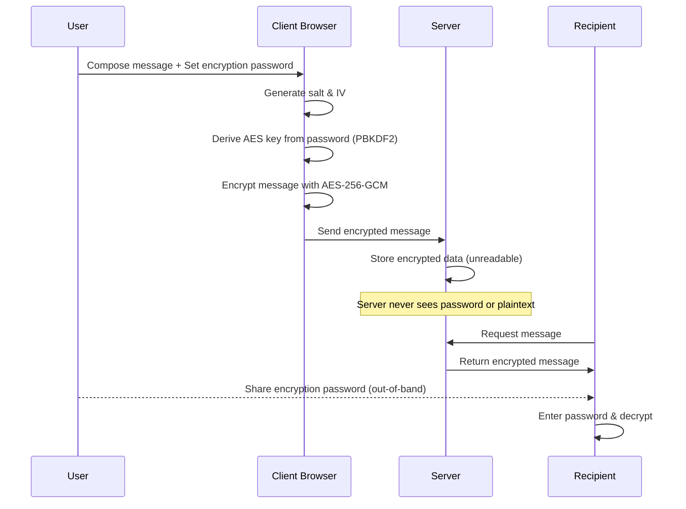
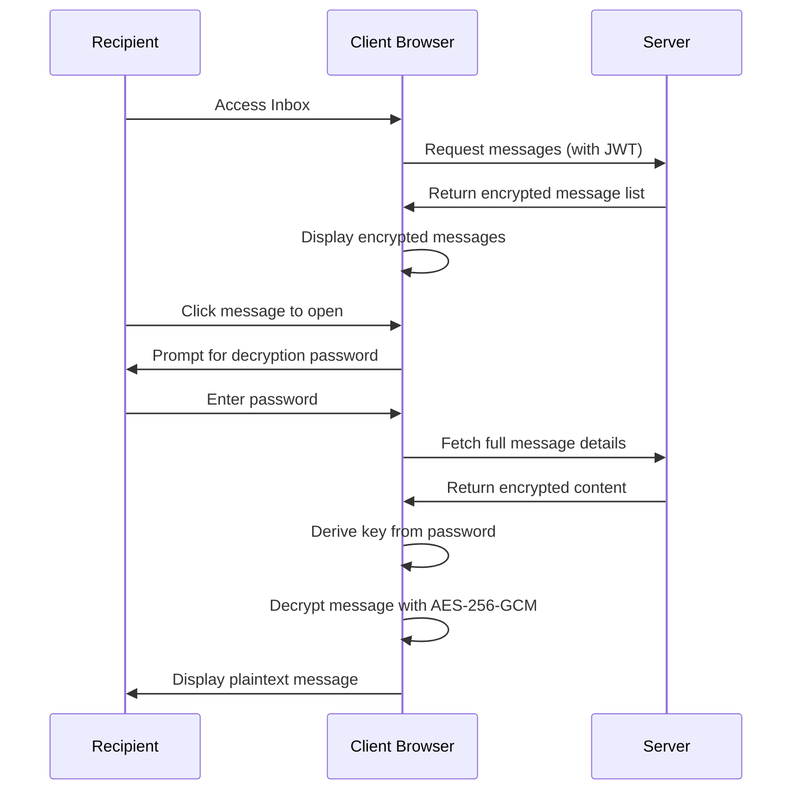
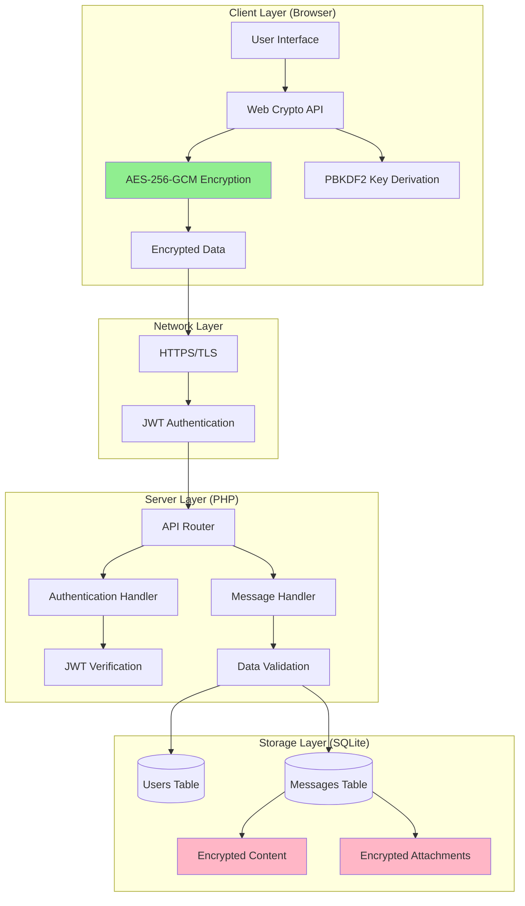
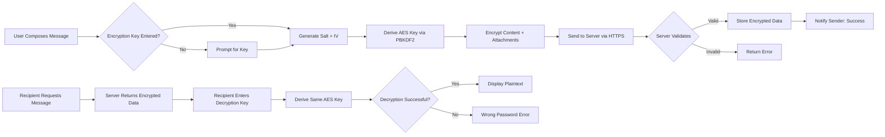

# 🔐 xsukax E2EE Local Mailing System

A zero-knowledge, end-to-end encrypted messaging system designed for secure, private communication. This lightweight application provides military-grade encryption while maintaining simplicity in deployment and operation—requiring only PHP and SQLite with no complex server configuration.

## 📋 Project Overview

The xsukax E2EE Local Mailing System is a self-hosted, privacy-focused messaging platform that implements true end-to-end encryption. Unlike traditional email systems where servers can access message content, this system ensures that encryption and decryption occur exclusively on the client side. The server stores only encrypted data and never has access to encryption keys, making it a zero-knowledge system where even the server administrator cannot read user messages.

**Core Architecture:**
- **Client**: Single-page HTML5 application with JavaScript cryptography (Web Crypto API)
- **Backend**: RESTful PHP API with SQLite database
- **Encryption**: AES-256-GCM with PBKDF2 key derivation (100,000 iterations)
- **Authentication**: Secure JWT (JSON Web Token) based session management
- **Database**: Lightweight SQLite with optimized indexes and WAL mode

The system operates entirely locally or on any standard PHP hosting environment, eliminating dependencies on third-party services and maintaining complete data sovereignty.

## 🛡️ Security and Privacy Benefits

### Zero-Knowledge Architecture
The fundamental principle of this system is that **the server never has access to your encryption keys or decrypted content**. All cryptographic operations occur within your browser using the Web Crypto API, ensuring that:
- Messages are encrypted before transmission to the server
- Decryption keys never leave your device
- Server administrators cannot decrypt stored messages
- No plaintext data is ever stored on the server

### Cryptographic Implementation
**Client-Side Encryption:**
- **Algorithm**: AES-256-GCM (Galois/Counter Mode) providing authenticated encryption
- **Key Derivation**: PBKDF2 with SHA-256, 100,000 iterations, and random salt
- **Initialization Vector**: Randomly generated 12-byte IV for each encryption operation
- **Data Format**: Salt (16 bytes) + IV (12 bytes) + Encrypted Data + Authentication Tag

**Server-Side Security:**
- **Password Storage**: bcrypt hashing with cost factor 12
- **Session Management**: JWT tokens with HMAC-SHA256 signatures and 7-day expiration
- **SQL Injection Prevention**: Parameterized queries using PDO prepared statements
- **Input Validation**: Comprehensive sanitization and validation of all user inputs
- **CORS Protection**: Configurable cross-origin resource sharing headers

### Privacy Guarantees
1. **End-to-End Encryption**: Only the sender and recipient can decrypt messages
2. **Forward Secrecy**: Each message uses unique encryption parameters (salt and IV)
3. **Metadata Minimization**: Only essential routing information is stored unencrypted
4. **No Third-Party Dependencies**: All operations are self-contained; no external tracking
5. **Attachment Encryption**: Files are encrypted with the same key as message content
6. **Secure Key Exchange**: Encryption passwords are shared out-of-band (never transmitted through the system)

### Threat Model Considerations
**What This System Protects Against:**
- Server breach: Encrypted data remains unreadable
- Network eavesdropping: All sensitive data transmitted in encrypted form
- Malicious server operators: Zero-knowledge design prevents access to content
- Database theft: Stolen database contains only encrypted messages

**Important Security Notes:**
- Users must securely share encryption passwords through alternative channels (Signal, in-person, etc.)
- Browser security is critical; compromised browsers can intercept keys
- Physical device security is the user's responsibility
- The system does not protect against endpoint compromise (malware on sender/recipient devices)

## ✨ Features and Advantages

### Core Functionality
- **🔒 True Zero-Knowledge E2EE**: Client-side AES-256-GCM encryption with no server-side key access
- **📎 Encrypted Attachments**: Full support for file attachments with integrated encryption
- **🗑️ Trash System**: Two-stage deletion (trash then permanent) for message recovery
- **📧 User-Friendly Mailbox**: Intuitive inbox interface with message preview and metadata
- **🔑 Secure Authentication**: JWT-based sessions with automatic token expiration
- **⚡ Fast Performance**: Optimized SQLite database with WAL mode and strategic indexing
- **🌐 Universal Compatibility**: Works on any domain with PHP support (shared hosting compatible)
- **📱 Responsive Design**: Mobile-friendly interface using modern CSS

### Deployment Advantages
1. **Minimal Requirements**: Only PHP 7.0+ and SQLite (included with most PHP installations)
2. **No Server Configuration**: Works with Apache and nginx without modification
3. **Single-File Deployment**: Just upload `index.php` and `client.html`
4. **Automatic Database Creation**: SQLite database is created automatically on first run
5. **Zero-Configuration CORS**: Pre-configured for cross-origin access
6. **Instant Setup**: Operational within minutes of file upload

### Operational Benefits
- **Self-Hosted Privacy**: Complete control over data storage and access
- **Cost-Effective**: Runs on inexpensive shared hosting or free-tier VPS
- **No External Dependencies**: No API keys, third-party services, or recurring fees
- **Scalable Design**: Suitable for personal use or small organizational deployments
- **Auditable Code**: Open-source codebase enables security audits and verification
- **Maintenance-Free**: SQLite requires no database administration

### User Experience
- **Clean Interface**: GitHub-inspired design aesthetic with intuitive navigation
- **Real-Time Feedback**: Toast notifications for all operations
- **Progressive Enhancement**: Works without JavaScript for basic functionality
- **Accessibility**: Semantic HTML and proper ARIA labels
- **Multi-Tab Support**: Consistent state across browser tabs

## 🚀 Installation Instructions

### Prerequisites
Ensure your hosting environment meets these requirements:
- **PHP**: Version 7.0 or higher (PHP 8.x recommended)
- **SQLite**: PDO SQLite extension (typically enabled by default)
- **Web Server**: Apache 2.4+ or nginx 1.18+
- **HTTPS**: SSL/TLS certificate strongly recommended for production use

### Deployment Steps

#### Option 1: Self-Hosted Backend (Recommended for Full Control)

1. **Prepare Your Hosting Environment**
   - Ensure PHP and SQLite are installed and enabled
   - Verify write permissions for the web directory (for SQLite database creation)

2. **Upload Backend File**
   ```bash
   # Upload index.php to your web server
   # Example directory structure:
   /var/www/html/mail/index.php
   ```

3. **Configure PHP (see PHP Configuration section below)**

4. **Verify Backend Installation**
   - Navigate to `https://yourdomain.com/mail/index.php` in your browser
   - You should see a JSON response indicating successful initialization:
   ```json
   {
     "success": true,
     "domain": "yourdomain.com",
     "version": "1.0.0",
     "system": "xsukax E2EE Local Mailing System"
   }
   ```

5. **Configure Client**
   - Open `client.html` in a text editor
   - Update the default API URL if needed (or enter it in the UI)
   - Deploy client.html to any web hosting or use the GitHub Pages version

#### Option 2: GitHub Pages Client with Self-Hosted Backend

1. **Deploy Backend** (follow steps 1-4 from Option 1)

2. **Use Pre-Hosted Client**
   - Navigate to: `https://xsukax.github.io/xsukax-E2EE-Local-Mailing-System/client.html`
   - Enter your backend URL when prompted: `https://yourdomain.com/mail`
   - The client will connect to your self-hosted backend

#### Option 3: Fully Self-Hosted (Backend + Client)

1. **Upload Both Files**
   ```bash
   /var/www/html/mail/
   ├── index.php    # Backend API
   └── client.html  # Web interface
   ```

2. **Access Your Installation**
   - Open `https://yourdomain.com/mail/client.html`
   - The client will automatically detect and connect to the backend

### Post-Installation Configuration

**Security Hardening:**
1. **Change JWT Secret** (in `index.php`):
   ```php
   define('JWT_SECRET', 'your-secure-random-string-here');
   ```
   Generate a strong secret using:
   ```bash
   openssl rand -base64 32
   ```

2. **Enable HTTPS**: Obtain an SSL certificate (Let's Encrypt recommended)

3. **Set File Permissions**:
   ```bash
   chmod 644 index.php
   chmod 666 xsukax_mail.db  # Created automatically on first run
   ```

4. **Configure Error Logging** (recommended for production):
   ```php
   ini_set('display_errors', 0);
   ini_set('log_errors', 1);
   ```

### PHP Configuration Requirements

**Required PHP Extensions:**
- `pdo_sqlite` - PDO driver for SQLite
- `json` - JSON encoding/decoding
- `openssl` - Cryptographic functions (for JWT)

**Recommended php.ini Settings:**
```ini
; Memory limit (adjust based on expected attachment sizes)
memory_limit = 256M

; Maximum upload file size
upload_max_filesize = 50M
post_max_size = 50M

; Maximum execution time for long operations
max_execution_time = 300

; Enable error logging (disable display_errors in production)
display_errors = Off
log_errors = On
error_log = /var/log/php/error.log

; Security settings
expose_php = Off
allow_url_fopen = Off
allow_url_include = Off

; SQLite settings (usually defaults are fine)
sqlite3.defensive = On
```

**Verify PHP Configuration:**
```bash
php -m | grep -E "pdo|sqlite|json|openssl"
```

Expected output:
```
json
openssl
pdo_sqlite
```

### Troubleshooting Common Installation Issues

**Issue**: "Database initialization failed"
- **Solution**: Ensure web server has write permissions to the directory
- **Command**: `chmod 755 /path/to/mail/directory`

**Issue**: "Connection refused" or CORS errors
- **Solution**: Verify API_URL is correct and includes `/index.php` for direct access
- **Check**: CORS headers are properly configured in `index.php`

**Issue**: "JWT signature verification failed"
- **Solution**: Ensure JWT_SECRET is consistent and not changed after user registration

**Issue**: 500 Internal Server Error
- **Solution**: Check `error.log` in the same directory as `index.php`
- **Debug**: Enable `display_errors` temporarily to see detailed error messages

## 📖 Usage Guide

### Getting Started

#### 1. Initial Connection
```
User → Client Interface → Enter Backend URL → Connect
```

When you first access the client:
1. Navigate to the client URL (GitHub Pages or self-hosted)
2. Enter your backend API URL (e.g., `https://yourdomain.com/mail`)
3. Click "Connect to Server"
4. The system will verify connectivity and display the domain

#### 2. User Registration
```
Connect → Register → Enter Username → Set Password → Create Account
```

Registration process:
1. Click the "Register" tab
2. Choose a unique username (3-30 alphanumeric characters)
3. Create a strong password (minimum 6 characters, longer recommended)
4. Your full email address will be: `username@yourdomain.com`
5. Click "Create Account"

**Security Note**: Passwords are hashed with bcrypt before storage; the server never stores plaintext passwords.

#### 3. Authentication
```
Registration Complete → Login → Enter Credentials → Access Mailbox
```

Login steps:
1. Enter your username (domain is shown automatically)
2. Enter your password
3. Click "Login"
4. You'll receive a JWT token valid for 7 days

### Core Operations

#### Composing and Sending Encrypted Messages

The encryption workflow ensures end-to-end security:



**Step-by-Step Process:**

1. **Navigate to Compose Tab**
   - Click "✉️ Compose" in the mailbox interface

2. **Fill Message Details**
   - **Send To**: Enter recipient's username (domain added automatically)
   - **Subject**: Message subject line (not encrypted, used for organization)
   - **Encryption Key**: Create a strong password for this specific message
   - **Message**: Compose your message content

3. **Add Attachments (Optional)**
   - Click "Choose Files" to select attachments
   - All files will be encrypted with the same key
   - Maximum total size: 50MB

4. **Send Message**
   - Click "🔒 Send Encrypted Message"
   - Message is encrypted in browser before transmission
   - Server stores only encrypted data

5. **Share Encryption Key**
   - **Critical**: You must securely share the encryption password with the recipient
   - Use a secure channel: Signal, in-person, phone call, etc.
   - **Never** send the password through this system

#### Reading Encrypted Messages



**Reading Process:**

1. **View Inbox**
   - Click "📥 Inbox" tab
   - See list of received messages (subjects visible, content encrypted)

2. **Open Message**
   - Click on any message to open
   - System prompts for decryption password

3. **Decrypt and Read**
   - Enter the encryption password shared by the sender
   - Click "🔓 Decrypt & View"
   - Message content and attachments are decrypted in real-time

4. **Download Attachments**
   - Decrypted attachments appear as download links
   - Click to download the original file

#### Message Management

**Move to Trash:**
- Click "🗑️ Move to Trash" when viewing a message
- Message moves to Trash folder (recoverable)

**Permanent Deletion:**
- Open "🗑️ Trash" tab
- Click on message to view
- Click "⚠️ Delete Permanently"
- Message is irreversibly deleted

**Refresh Mailbox:**
- Click "🔄 Refresh" button to load new messages
- Automatic refresh every time you switch tabs

### System Architecture



**Key Points:**
- Green boxes: Client-side encryption (secure)
- Pink boxes: Encrypted storage (server cannot read)
- All sensitive data is encrypted before leaving the browser
- Server only handles routing and storage of encrypted data

### Advanced Usage

#### Multi-User Communication
The system supports multiple users on the same domain:
- Each user registers with a unique username
- Users can message any other registered user
- Format: `username@yourdomain.com`

#### Security Best Practices
1. **Strong Encryption Passwords**: Use unique, complex passwords for each message
2. **Secure Password Sharing**: Never share encryption keys through the system itself
3. **Regular Password Changes**: Change your account password periodically
4. **Logout After Use**: Always logout on shared or public computers
5. **HTTPS Only**: Never use the system over unencrypted HTTP connections
6. **Verify Recipients**: Confirm recipient identity before sending sensitive information

#### API Endpoints Reference

For developers integrating with the system:

| Endpoint | Method | Auth Required | Purpose |
|----------|--------|---------------|---------|
| `/` or `/info` | GET | No | Server information and status |
| `/register` | POST | No | Create new user account |
| `/login` | POST | No | Authenticate and receive JWT |
| `/send` | POST | Yes | Send encrypted message |
| `/messages?type={inbox\|trash}` | GET | Yes | List messages |
| `/message/{id}` | GET | Yes | Get specific message |
| `/message/{id}/trash` | POST | Yes | Move message to trash |
| `/message/{id}` | DELETE | Yes | Permanently delete message |

**Authentication**: Include JWT token in header: `Authorization: Bearer {token}`

### Data Flow Diagram



## 📄 Licensing Information

This project is licensed under the GNU General Public License v3.0.

---

## 🤝 Contributing

Contributions are welcome! Please feel free to submit issues, fork the repository, and create pull requests for bug fixes, features, or documentation improvements.

## 📞 Support

For issues, questions, or feature requests, please visit:
- **GitHub Repository**: [https://github.com/xsukax/xsukax-E2EE-Local-Mailing-System](https://github.com/xsukax/xsukax-E2EE-Local-Mailing-System)
- **Live Client**: [https://xsukax.github.io/xsukax-E2EE-Local-Mailing-System/client.html](https://xsukax.github.io/xsukax-E2EE-Local-Mailing-System/client.html)

## ⚠️ Security Disclosure

If you discover a security vulnerability, please email the maintainer directly rather than opening a public issue. Responsible disclosure is appreciated.

---

**Built with privacy and security as foundational principles. Your data, your control.**
